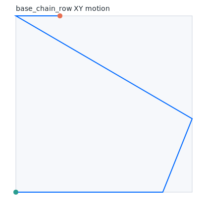
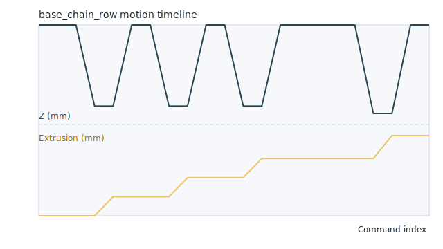

# Base chain row recipe

Kick off crochet motion experiments with a compact base chain and a single
row of stitches. This recipe pairs the pattern CLI DSL with the planner-oriented
JSON format and links to rendered previews so learners can compare the text
instructions with the resulting motion.




Use the DSL snippet below with ``python -m wove.pattern_cli`` to generate
G-code-like output or planner metadata:

```pattern-cli
# Lay down a foundation chain, turn, and add a row of single crochet
CHAIN 6
TURN 6
SINGLE 5
```

Generate the planner format to feed into visualization or browser-based tools.
The excerpt below was produced by running ``python -m wove.pattern_cli --format
planner --text "$(cat recipe.txt)"`` with the DSL snippet saved to ``recipe.txt``.

```json
{
  "version": 1,
  "units": "millimeters",
  "defaults": {
    "safe_z_mm": 4.0,
    "fabric_plane_z_mm": 0.0,
    "travel_feed_rate_mm_min": 1200,
    "plunge_feed_rate_mm_min": 600,
    "yarn_feed_rate_mm_min": 300,
    "default_row_height_mm": 6.0
  },
  "bounds": {
    "x_mm": {"min": 0.0, "max": 27.5},
    "y_mm": {"min": 0.0, "max": 12.0},
    "z_mm": {"min": -2.0, "max": 4.0},
    "extrusion_mm": {"min": 0.0, "max": 3.0}
  },
  "commands": [
    {"index": 0, "command": "G21", "comment": "use millimeters", "state": {"x_mm": 0.0, "y_mm": 0.0, "z_mm": 4.0, "extrusion_mm": 0.0}},
    {"index": 1, "command": "G90", "comment": "absolute positioning", "state": {"x_mm": 0.0, "y_mm": 0.0, "z_mm": 4.0, "extrusion_mm": 0.0}},
    {"index": 2, "command": "G92 X0.00 Y0.00 Z4.00 E0", "comment": "zero axes", "state": {"x_mm": 0.0, "y_mm": 0.0, "z_mm": 4.0, "extrusion_mm": 0.0}},
    {"index": 3, "command": "G1 Z-1.50 F600", "comment": "chain stitch 1 of 6: plunge", "state": {"x_mm": 0.0, "y_mm": 0.0, "z_mm": 4.0, "extrusion_mm": 0.0}},
    {"index": 4, "command": "G1 E0.50 F300", "comment": "chain stitch 1 of 6: feed yarn", "state": {"x_mm": 0.0, "y_mm": 0.0, "z_mm": -1.5, "extrusion_mm": 0.5}}
  ]
}
```

The full planner output continues with the remaining chain stitches, the turn
move, and the single crochet row. Feed the JSON into downstream tooling or use
the visualization harness in ``scripts/pattern_visualize.py`` to refresh the
SVG previews.
