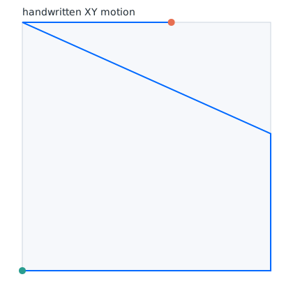

# Pattern translation CLI

`wove.pattern_cli` turns a compact crochet stitch description into a
G-code-like motion sequence that you can stream to firmware or inspection tools.
The translator focuses on early-stage prototyping rather than production-grade
path planning, but it demonstrates how a text pattern becomes coordinated motion.

## Supported commands

The domain-specific language (DSL) accepts one command per line. Lines that are
empty or start with `#` are ignored.

| Command | Description |
| --- | --- |
| `SLIP <count>` | Emit slip stitches for compact joins without adding height. |
| `CHAIN <count>` | Emit chain stitches spaced evenly along the X axis. |
| `SINGLE <count>` | Emit single crochet stitches with a deeper plunge and additional yarn feed. |
| `DOUBLE <count>` | Emit double crochet stitches with a taller pull-up motion. |
| `MOVE <x> <y>` | Lift safely, then travel to absolute `(x, y)` coordinates in millimeters. |
| `TURN [height]` | Reset X=0, advance Y to next row, optionally override default 6 mm height. |
| `PAUSE <seconds>` | Insert a `G4` dwell for the specified number of seconds. |

Values must be positive finite numbers. MOVE enforces positive coordinates, so
zero, negative, or non-finite positions raise `ValueError`. Invalid commands or
parameters raise `ValueError` and stop translation so mistakes surface early.

## Example

Save the following pattern as `pattern.txt`:

```text
# form a base chain, reposition, and add a single crochet
CHAIN 3
PAUSE 0.4
MOVE 18 5
TURN 7
SINGLE 1
```

Translate it into G-code-like output:

```bash
python -m wove.pattern_cli pattern.txt
```

The CLI prints commented commands:

```text
G21 ; use millimeters
G90 ; absolute positioning
G92 X0.00 Y0.00 Z4.00 E0 ; zero axes
G1 Z-1.50 F600 ; chain stitch 1 of 3: plunge
G1 E0.50 F300 ; chain stitch 1 of 3: feed yarn
G1 Z4.00 F600 ; chain stitch 1 of 3: raise
G0 X5.00 Y0.00 F1200 ; chain stitch 1 of 3: advance
...
G4 P400 ; pause for 0.400 s
G0 X18.00 Y5.00 F1200 ; reposition
G0 X0.00 Y12.00 F1200 ; turn to next row
G1 Z-2.00 F600 ; single stitch 1 of 1: plunge
G1 E2.10 F300 ; single stitch 1 of 1: feed yarn
G1 Z4.00 F600 ; single stitch 1 of 1: raise
G0 X4.50 Y12.00 F1200 ; single stitch 1 of 1: advance
```

Slip stitches are helpful for joining rounds or anchoring motifs without adding height. Emit them
just like other stitches:

```bash
python -m wove.pattern_cli --text "SLIP 2\nCHAIN 1"
```

The output begins with compact slip stitch motions before advancing to the chain stitch.

Use `--format json` to inspect a structured representation for downstream
pipelines:

```bash
python -m wove.pattern_cli --text "CHAIN 1\nDOUBLE 1" --format json
```

Golden-motion regression fixtures live in `tests/fixtures/patterns/`. The
translator is exercised against those curated patterns by
`tests/pattern_cli/test_golden_outputs.py`, ensuring the emitted G-code,
JSON, and planner metadata remain stable as the CLI evolves. Run the focused
suite during development to verify the snapshots:

```bash
pytest -k pattern_cli
```

Generate educator-friendly previews from those same fixtures with
`scripts/pattern_visualize.py`. The harness renders an X-Y motion sketch and a
timeline showing Z height and yarn feed progression for each pattern. Export
the SVG previews into the Sphinx static assets directory (the defaults target
`docs/_static/pattern_previews/`) or bundle them as a zip archive for sharing
with collaborators:

```bash
python scripts/pattern_visualize.py --pattern handwritten --force
python scripts/pattern_visualize.py --pattern handwritten --force \
  --archive previews.zip
```

The command above produces `handwritten-chart.svg` and
`handwritten-timeline.svg`. Embed them in documentation or share the files
directly with educators to illustrate how the CLI converts patterns into
motion. The optional `--archive` flag writes a compressed bundle containing the
generated SVGs, which the continuous-integration pipeline publishes as a
non-blocking artifact for quick inspection. A sample preview is shown below:



Provide planner-friendly metadata for the browser-based roadmap by emitting the
`planner` format. The payload includes per-command position snapshots,
feed-rate defaults, and the motion bounds so interactive tools can render the
sequence without parsing G-code first. When you supply a machine profile with
`--machine-profile`, the planner payload also embeds that axis metadata so the
front-end inherits the same microstepping, steps-per-millimeter, and travel
limits used during validation:

```bash
python -m wove.pattern_cli --text "CHAIN 1" --format planner
```

The resulting JSON object lists each command with its comment and the updated
`X`, `Y`, `Z`, and yarn-feed positions. Use the `defaults` block for safety
constraints such as the safe Z height and row spacing. When a machine profile
was provided, the `machine_profile.axes` mapping mirrors the JSON/YAML schema
loaded by `--machine-profile` so downstream planners can respect the same
travel envelope without re-reading the original file.

## Embedding the parser in automation

Automation helpers can reuse the CLI parser without shelling out. Import the
factory from `wove.pattern_cli` or the dedicated options module to keep argument
handling consistent across scripts:

```python
from wove.pattern_cli import build_parser

parser = build_parser()
args = parser.parse_args(["--format", "json", "--text", "CHAIN 1"])
```

The `wove.pattern_cli.options.parse_args` helper mirrors the CLI surface and is
handy for higher-level wrappers that need a ready-to-use namespace. Both entry
points stay aligned with the command-line interface described above.

Refer to [`docs/schema/pattern-cli.schema.json`](schema/pattern-cli.schema.json)
for a machine-readable description of the planner format. The schema mirrors
the default units (millimeters), enumerates the command state snapshot fields,
and constrains the axis bounds included in the payload. Validate generated
files with [`jsonschema`](https://github.com/python-jsonschema/jsonschema):

```bash
python -m wove.pattern_cli --text "CHAIN 1" --format planner > planner.json
python -m jsonschema -i planner.json docs/schema/pattern-cli.schema.json
```

When you supply `--machine-profile`, the planner payload includes a
`machine_profile.axes` block that mirrors the microstepping, steps-per-mm, and
travel limits loaded from disk. The JSON Schema recognizes this optional block,
so validation still succeeds even with the embedded metadata:

```bash
python -m wove.pattern_cli --text "CHAIN 1" --format planner \
  --machine-profile machine-profile.json > planner.json
python -m jsonschema -i planner.json docs/schema/pattern-cli.schema.json
```

Sample pattern inputs live under `tests/fixtures/patterns/` and cover both
hand-authored DSL snippets (`handwritten.txt`) and SVG-generated MOVE sequences
(`triangle.svg`). They provide quick references for exercising the CLI and the
schema-backed planner payload in tests or tooling experiments.

## Homing guard

The robotic crochet design doc stresses that the gantry must be homed before
running motion. Pass ``--require-home`` to enforce this guard at translation
time. The CLI refuses to emit motion commands when the reported homing state is
``unknown``; set ``--home-state homed`` after completing a homing cycle:

```bash
python -m wove.pattern_cli pattern.txt --require-home --home-state homed
```

If you skip ``--home-state homed`` while ``--require-home`` is present, the CLI
aborts with an explanatory error instead of generating G-code.

## Machine profiles and travel limits

Load a JSON or YAML machine profile with ``--machine-profile`` to validate each
generated move against the travel limits described in
[`docs/wove-v1c-design.md`](wove-v1c-design.md). The file lists axis metadata
such as microstepping, steps-per-millimeter, and minimum/maximum travel. The CLI
aborts when a pattern would exceed those limits so hardware never receives
commands outside its safe envelope.

```bash
python -m wove.pattern_cli pattern.txt --machine-profile machine-profile.json
```

Profiles accept either lowercase or uppercase axis names. When the CLI reports
a violation it echoes the axis, attempted position, and allowed range so you
can adjust the pattern or update the profile.

## Importing SVG polylines

Provide an SVG file containing a `polyline` or `polygon` element to trace its vertices as travel
moves. The CLI emits `MOVE` commands for each vertex after applying optional scaling and offsets:

```bash
python -m wove.pattern_cli --svg sketch.svg --svg-scale 1.5 --svg-offset-x 10 --svg-offset-y 5
```

This limited importer focuses on quick mechanical experiments, so it ignores curves and other path
commands. Clean up artwork so only the desired polyline or polygon remains before converting it.
